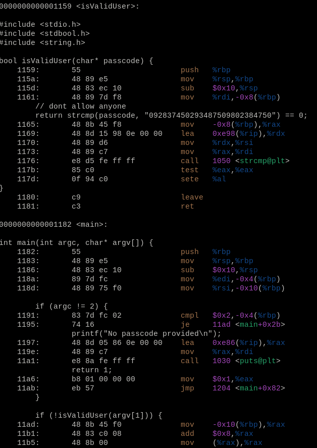

# Developer side

1. Create application source file in c language

   Here we just check if validation function returns false then we deny access to out application.

   

2. Compile application with no symbol information

   ```bash
   $ gcc app.c -o app
   ```

3. Test your application.

   

# Hacker side

1. Run application with debugger to locate code that blocks us. This is just to localize the problem. In our case we could avoid this step as binary is small in size. (Optional)

   

   Stepping through code we can see that after the call to the validation function we check if returned value through register named $eax is equal to the value 0x1 (true) then we run our application else we will terminate. This is the issue spot.

   There are several modification we can make, for example using no-op or some other instruction.

   But the simplest solution is just modify the 'test' instruction to invert the logic.

   If the user will enter the correct password the error will occur else we'll pass.

2. Disassemble binary to find address of the issue instruction in the file address space

   

   The 'test' instruction has embedded argument in itself with the value '0x1' that we need to change.

   

3. Change binary so that we avoid login check.

   

   value '0x1' at afdress '000011c2' changed to '0x0'

   

4. Done - Sell secret information for some $

   
   
   
   
   # Additional information

1. Used Machine (Arch Linux)


2. GCC compilation

   - **-g** option - tells the compiler to produce symbol table for object file code (maps source code to the produced object instructions).

   With the -g option we can see source code in the object file (objdump -S app)

   .

   - **-o *name*** option - tells the compiler to produce application with specified ***name***. 

     Например **-o *app*** означает название файла должно быть ***app***

3. Редактирования скомпилированного файла **app**

   Используется графическое приложение GHex **https://wiki.gnome.org/Apps/Ghex**

   Открывается файл **app** и изменяется 0x01 на 0x00 а затем этот файл **сохраняется** с тем же именем а затем он же и запускается заного - этот файл взломанная версия. (Никакие исходники например app.c не изменяются так ка у нас нет доступа кним со стороны аттакующего)

   

4. Замечания по коду

   

Тут выбрано произвольное число для того чтобы никого не пропускать кто его не знает. Число может быть любым и нужно просто для наглядности примера. После воода такого число как аргумент программе, программа разблокируется, иначе будет выход с ошибкой о неверном пароле.


Пример с неправильным паролем.


